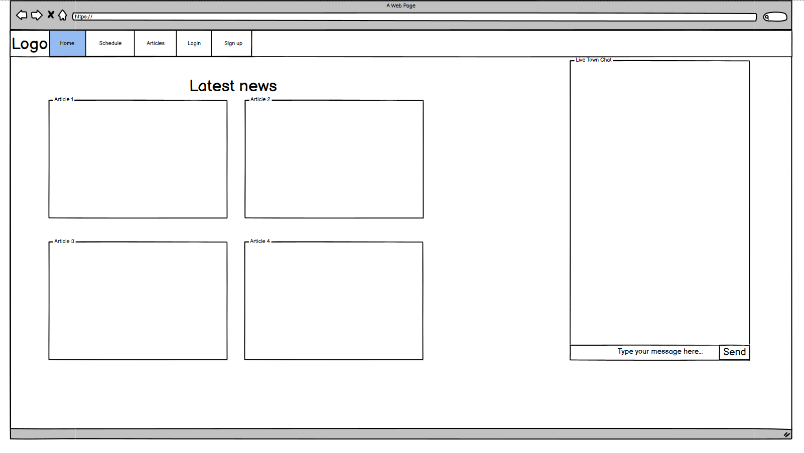
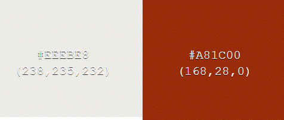
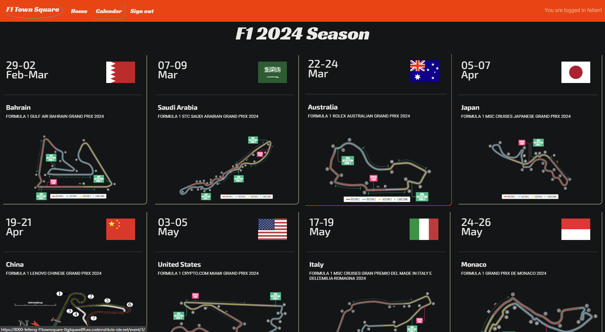
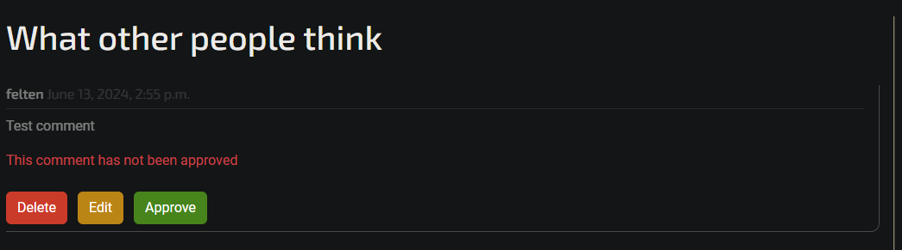
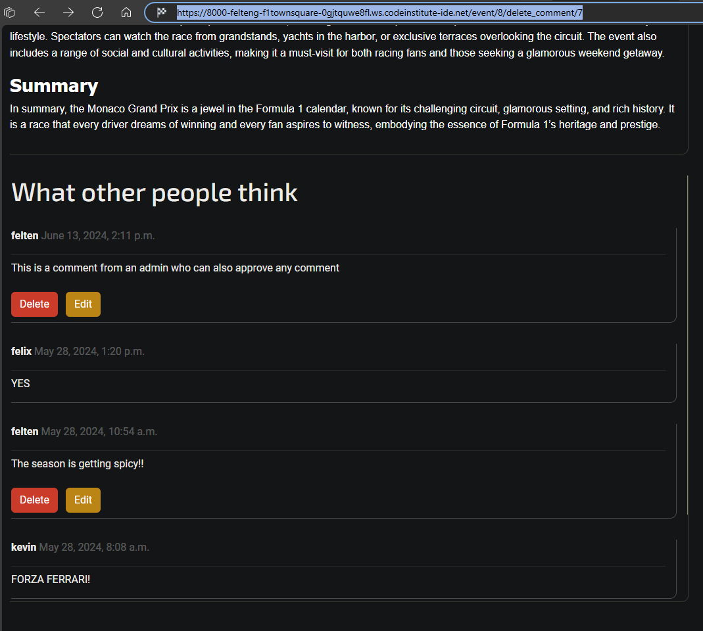

# F1 Town Square

[Link to live site]() 

## Table of Contents

- [UI/UX](#uiux)
    - [Agile](#agile)
    - [Wireframes](#wireframes)
    - [Site Goals](#site-goals)
    - [5 Planes of UX](#5-planes-of-ux)
    - [Visual Design Choices](#visual-design-choices)
    
- [Features](#features)
    - [Current Features](#current-features)
    - [Future Features](#future-features)
   
- [Database Design](#database-design)
    - [Database Model](#database-model)
    - [Custom Model](#custom-model)
    - [CRUD](#crud)

- [Technologies Used](#technologies-used)
    - [Environemnts](#environments)
    - [Python Libraries and Packages](#python-libraries-and-packages)
    - [Django Packages](#django-packages)
    - [External Libraries and Packages](#external-libraries-and-packages)
    - [Database](#database) 

- [Testing](#testing)
    - [Test Guide](#test-guide)
    - [Validator Testing](#validator-testing)
    - [Browser Testing](#browser-testing)
    - [Addressed Bugs](#addressed-bugs)
    - [Unaddressed Bugs](#unaddressed-bugs)

- [Deployment](#deployment)
    - [Local Deployment](#local-deployment)
    - [Live Deployment](#live-deployment)

- [Source Credits](#source-credits)
    - [Technical](#technical)
    - [Media](#media)
    - [Honorable Mentions](#honorable-mentions)
    

## UI/UX

- UI
    - The overall look and design of the site aims to create a resemeblance to racing as that's the Formula 1 racing is at the soul of the site.

    - Layout, responsiveness, and navigation are all kept to an approach familiar across most web pages as to avoid plaguing the user with trying to figure out how to even engage with the navigation.

- UX
    - The interactivity focuses on user to user interaction with the live town chat at the home page, as well as the user written comments found on any individual event.

    - User experience has been a major focus for the implementation of various features; Whenever the user performs an account authentication action (sign in, sign up, sign out) they will be returned to the page they were previously on, if appropriate. The redirection ensures a smoother experience in for example the event that a user wants to comment but has to log in, so instead of being returned back all the way to the home page they will be returned to the origin of why they wanted to log in in the first place.

    - Another example of an ensured more fluid experience is that of any comment action performed under an event page. Instead of returning to a page and landing at the top after the action is completed, the scroll level of the window will be automatically restored for the user to return to the same view they had when engaging with the action.

### Agile

The entirety of this project has been built utilising the agile development approach. The agile approach, combined with GitHub projects, has served as a tool that has helped visualise, plan, and execute different phases of the project development. The [GitHub project](https://github.com/users/Felteng/projects/3) created for this project features a kanban board where the various issues and their status can be seen.

To view the user stories set out for this project please refer to the project link in the above paragraph. By clicking on any user story on the board a detailed view containing the user story and it's acceptance criteria will be made visible. All the issues on the kanban board have received different labels to convey things like relevancy and importance.

### Wireframes

The initial Balsamiq wireframes are very simplified mockups of site layout to help steer development.

*Since these initial wireframes, part of the scope of the project was altered early on to not feature any articles and instead build upon the indivual events on the calendar.*


<details>
    <summary>
        Wireframes
    </summary>
    
    
    
    
</details>

### Site Goals

The goal of this site is to provide anyone with an interest, mild or large, with a town square like experience where you can stay up to date on the dates of the current seasons calendar, engage in discussion, or even engage in the live town chat. Event comments are restricted by admin approval to avoid malicous bloat or anything of the sort. The live town chat on the other hand is a bit different as its data is not stored to be displayed to any visitng user, this is delibrate as the intention here is for it act like a real life interaction of people happening to share a similar interest. Anyone who partook in the live discussion will now what is was about and all the little details, but once the page is left or refreshed so is the data. Depending on the future scope and plans for scalabilty the chat could be converted to store and display data too, no such plans have been made but of course there are possibilities for lots of different [future features](#future-features).

In short it's a sort of hub for anyone familiar, or wanting to get familiar with the world of F1.

### 5 Planes of UX

#### Strategy


#### Scope


#### Structure


#### Skeleton


#### Surface


### Visual Design Ideology

**Color Scheme:**
- The base scheme of the site is built with "dark theme" in mind as it's a theme becoming increasingly popular and tends to be a lot easier on the eyes for the user. There is not sacrifice in contrast or user experience to achieve the darker aestetic. The goal is to provide a friendly looking interface that won't appal the user from using the site for any extended period of time.

- To achieve the darker theme every page features shade of woodsmoke as the background. \


- Furthermore the site incorporates some staple racing colors, such as the very vibrant, scarlet red navigation bar, combined with the white text. \


- Most element borders feature 1 of 2 different shades an olive haze color which aims to provide an organic looking seperation of content. \


- The last contrasting color is that of a very dark shade of blue featured at the page footer as well as the hero seperator on an events details page. It blends quite nicely with the dargker background while still providing contrast for content seperation without causing a large shift of focus. \


**Fonts:**
- Racing Sans One
    - The Racing Sans One font has been used in the navbar elements as well as the season calendar heading. Its dynamic and sporty design helps convey a sense of speed, which is the essence of motorsport, and it helps draw attention to the key elements of the site even though they are smaller in size than the ladning page headings. It has very eye catching characteristics yet it remains a very readable font.

- Exo 2
    - Exo 2 has been exerted for all headings on the page bar the calendar heading. It helps convey yet another sense of a modern, sporty feeling albeit while being a lot less robust than the Racing Sans One font. This is perfect because it avoids an overwhelming sense of repetetion in the case that Racing Sans One would be used for all the heading as well as the nav elements, it would very easily split the focus of the user. The sporty modern nature of the font helps the various content headings stand out while not drawing as much attention as Racing Sans One.

- Roboto
    - Roboto features a modern and geometric design with clean lines and a neutral, yet friendly appearance, providing great readability. This makes it the perfect font for the various pieces of content the site aims to convey.

**Images:**
- A wide range of imagery has been used throughout the project to convey a multitude of different meanings.
    - Country flags have been used to represent each event's country. The flags are .svg vectors which is of massive help for scalability and visual consistency across each country's representation. Huge thanks to [lilpis](https://github.com/lipis/flag-icons) for the library used.
    - More .svg vectors have been used for each event to show the layout of the event's track layout. Yet again this provides great scalability and consistency. The creators can be found at [Circuit SVGs](#circuit-svgs).
    - Whenever an event is visited each page features a hero image related to the event in question to help paint a more comprehensive picture of the event as a whole.
    - Lastly another vector is used as the default image if no track layout vector is provided. It is also used for the 3 most recent events visible on the home page to represent the event's finished state.


**Icons:**
- The use of icons have been kept on the lower end and they have simply been used to help convey an elements purpose and action. 2 examples of this is the left caret for the go back button when user lands on a 404 page, and the paper plane icon in the live chat to signify send message. \
     \
    


## Features


### Current Features
- **Navigation**
    - Navbar with navigation links to the various pages on the site as well as the logo.

    - Slightly different naviational links depending on whether the user is authenticated or not.

    - Current page is highlighted with a similar border layout found across many elements on the site.

    - On mobile devices the navbar turns into a collapsable menu through the intuitive and familiar burger menu.

    - Features a very mute text letting the user know if they're logged in and who they are logged in as.
        <details>
        <summary>
            Navigation images
        </summary>
        <p></p>
        <p></p>
        <p></p>
        </details>

- **Home page**
    - Features no introductory text as I believe it can often create a bit of a turmoil for a new visitng user, at least that's how I often times experience it.

    - The purpose and introduction attempts to be conveyed through the landing page content and intuitive accessible design.

    - Features the live town chat where a user may engage in any live discussion with another user.

    - Features a list of 4 cards that shows the closest upcoming grand prix as well as the previous 3 grand prix.
        <details>
        <summary>
            Home page images
        </summary>
        <p></p>
        <p></p>
        </details>

- **Live town chat**
    - Featured on the home page where any user may engage in live discussion. Most notably this would be used during the events of a grand prix weekend when discussion is at its peak.

    - Notifies the user when they've been connected as well as if the websocket connection gets closed.

    - The chat input box will not be visible to a user that is not signed in, and will instead display a message letting the user know they should sign in.
        - The user can still read anything being sent in the chat even though they're logged out.

    - On purpose features no database model or storage to simulate that of a real world interaction where the discussion held is remembered by those involved and can't be relived by an external visitor after it has taken place.

        - So whenever the page is refreshed the data will be lost.

    - The chat input box will not be visible to a user that is not signed in, and will instead display a message letting the user know they should sign in.

        - The user can still read anything being sent in the chat even though they're logged out.
        <details>
        <summary>
            Live town chat images
        </summary>
        <p></p>
        <p></p>
        <p></p>
        <p></p>
        </details>

- **Registration page**
    - Features an ordinary registration form with email address being optional and appropiate feedback if fields are left empty.

    - Upon registration the user is automatically signed in to the registered account and taken back to the page they were on before initating registration.

        - The page being returned to will not be another account authentication page, for example if the user clicked on a sign in prompt under an event and then realised that they need to sign up first, they will not be returned to the login page and instead back to the page they were on.

        - If the previous page is a 404 page the user is redirected to the home page instead.
        <details>
        <summary>
            Registration images
        </summary>
        <p></p>
        <p></p>
        </details>

- **Sign in page**
    - Features a simple sign in form with appropiate feedback if fields are left empty.

    - If the wrong password is provided the username entered will stay in the field for the password to be attempted again without having to type the username again.

    - On successful sign in the user will be redirected to the previous page they were on before initating the sign in action.

        - If the previous page is a 404 page the user is redirected to the home page instead.
        <details>
        <summary>
            Sign in images
        </summary>
        <p></p>
        <p></p>
        </details>

- **Sign out page**
    - Features 2 simple buttons to sign out or to cancel the action. 

    - Clicking cancel will return the user to the previous page.

    - On successful sign out the user will be redirected to the previous page they were on before initating the sign out action.

        - If the previous page is a 404 page the user is redirected to the home page instead.
        <details>
        <summary>
            Sign out images
        </summary>
        <p></p>
        <p></p>
        </details>

- **Calendar page**
    - Features a list of event cards for each event planned for the current season.

    - The familiar boders wrap the cards and the cards feature the relevant dates, event name, location, and an image of the circuit layout.
        - The end date of events is calculated and not set by the site admin as some regulations set within the sport ensure that the event will end 2 days after it starts. If that ever changes a manual end date will be added.

    - Each card when clicked leads to a logical URL which displays a page with extended details for that event.

    - When a card is hovered it will grow sligtly and the border will turn red to indicate which event is being viewed.

    - If an event that does not exist is attempted to be viewed a detailed 404 page will let the user know there is no event at that url. For example /event/25/ in this 24 event season calendar.
        <details>
        <summary>
            Calendar images
        </summary>
        <p></p>
        <p></p>
        <p></p>
        </details>

- **Detailed event page**
    - Any event that has details added to it will be able to be viewed on a seperate page.

    - The page features a hero image related to event as well as the event name.

    - There is a section with some key information about the event as well as it's history and what challenges it may provide.

    - A larger view of the circuit layout, the circuit name, as well as some interesting stats for the circuit is also present.

    - At the bottom of the page the user will find a comment form if they're logged in as well as a container for the comments.

        - If a user is not logged in the form will not be generated and instead a prompt will be in its place asking the user to sign in to comment.

        - If there are no approved comments under a post the container will let the user know that no one has shared their thoughts yet.

        - The comments container is scrollable with a minimalistic scrollbar that blends in with the border.
        <details>
        <summary>
            Event page images
        </summary>
        <p></p>
        <p></p>
        <p></p>
        <p></p>
        </details>

- **CRUD buttons**
    - Comments left under any event feature full CRUD functionality.

        - If a user is logged in they may create a comment through the comment form.

            - A comment has to approved by a site admin before it will be visible to other users.

        - If a user is logged in and is the author of a comment they may edit the comment.

        - If a user is logged in and is the author of a comment they may delete the comment.

        - A site admin may also approve a comment through from the event page.

    - Whenever any CRUD button is pressed and the request is sent the button gets disabled to avoid excessive requests being made and bugs occuring.

    - Whenever a CRUD button is pressed the users y-scroll position is captured so that went the operation is done they will be returned to the same scroll and view as when the action was made.
        <details>
        <summary>
            CRUD button images
        </summary>
        <p></p>
        </details>

- **Creating a comment**
    - Any logged in user may use the comment form to create and post a comment.

    - Upon submitting a comment the submit button will turn grey and will not be clickable again while the request is being processed.

        - When the submit button is clicked the scroll position is saved and restored after the request and redirect is finished.

    - Once the comment is posted it will be unapproved and visible only to the author and a user with superuser status.

    - If the form is empty the button will not be disabled and instead a prompt asking the user to fill out the text field will be shown.
        <details>
        <summary>
            Create comment images
        </summary>
        <p></p>
        <p></p>
        <p></p>
        </details>

- **Editing a comment**
    - A logged in user who is also the author of a comment may edit the comment as they wish.

    - When the edit button is clicked the comment area will turn into an editable text area an a save button will appear.

        - If the edit button is clicked the scroll position gets saved so it can restore the user to same view after the request is done.

        - The save button will also be disabled after initiating the request.

    - When the edit button is clicked it gets converted into a cancel button instead.

        - The user can then toggle between these 2 states if necessary.

        - Whenever the cancel button is clicked the stored scroll position gets cleared.

    - Once an edit action is saved the comment will be returned to an unapproved status.
        <details>
        <summary>
            Edit comment images
        </summary>
        <p></p>
        <p></p>
        <p></p>
        <p></p>
        </details>

- **Approving a comment**
    - An authenticated superuser will see any comments comments posted whether they are approved or not.

    - An unapproved comment will have a green approve button visible which can be clicked at any time to approve the comment so any other user may also see that comment.

    - When the approve button is clicked the request to approve gets initiated and the button gets disabled to avoid multiple requests.

        - The scroll position of the superuse will also be saved so that they are returned to the same position and can carry on approving comments or what have you.
        <details>
        <summary>
            Approve comment images
        </summary>
        <p></p>
        <p></p>
        <p></p>
        </details>

- **Deleting a comment**
    - A logged in user who is also the author of a comment may delete the comment if they so wish.

    - When the delete button is clicked a confirmation modal appears on the users screen to confirm whether they want to delete the comment or not.

    - If the delete button on the modal is clicked the request to delete the comment gets processed.

        - The button will be disabled after clicking to prevent bugs and 404 errors.

        - The users scroll position will also be stored so that they are returned to the same position as when the delete request was initiated.

    - The user can also close the modal by clicking on the close button or the X in the top right corner of the modal. 
        <details>
        <summary>
            Delete comment images
        </summary>
        <p></p>
        <p></p>
        <p></p>
        <p></p>
        </details>

- **Action response messages**
    - Whenever an action gets completed a message appears on the users screen.

    - The messages can be closed manually and will also dissapear automatically after 4 seconds.

    - Messages appear after things like: Successful sign in, sign out, and or sign up. Any successful comment CRUD action.
        <details>
        <summary>
            Message images
        </summary>
        <p></p>
        <p></p>
        </details>

- **Unauthorized request handling**
    - If a user that is unauthorized for an action tries to perform one feedback is provided in various ways.

        - Performing such a request would be done through editing the url manually.

        - If a user is signed out and tries to perform any CRUD request they will be redirected to the sign in page.
            <details>
            <summary>
                Trying to delete a comment from another author when signed in
            </summary>
            <p></p>
            <p></p>
            </details>
            <details>
            <summary>
                Trying to approve a comment as a normal user
            </summary>
            <p></p>
            <p></p>
            </details>
### Future Features


## Database Design

### Database Model
The entiry relationship diagram for the initial database model was made using [Cacoo's](https://cacoo.com) diagram tool.


### Custom Model


### CRUD

The principles of CRUD are at the essence of this project's features and any future features.

**Create:**
An authenticated user can create comments and send messages in the live chat.

**Read:**
A user can browse and read about the current season's race events and any comments made under them, as well as the conversation in the live chat.

**Update:**
An authenticated user can edit and update their individual contributions to the site.
- The live chat features no database model and the messages are therefore lost whenever the page is refreshed. This is to mimmick the experience of meeting and conversing with a group of individuals with the shared interest of F1 and racing in the real world.

**Delete:**
An authenticated user can delete any of their contributions made to the site.
- The live chat features no database model and the messages are therefore lost whenever the page is refreshed. This is to mimmick the experience of meeting and conversing with a group of individuals with the shared interest of F1 and racing in the real world.

## Technologies Used

### Environments

- [Balsamiq](https://www.balsamiq.com/) (Wireframes)
- [Cacoo](https://cacoo.com/) (ERD creation)
- [GitHub](https://github.com/) (Version control)
- [GitPod](https://gitpod.io/) (IDE)
- [Heroku](https://heroku.com/) (Site hosting)

### Python Libraries and Packages

- [Whitenoise](https://whitenoise.readthedocs.io/en/stable/index.html) (Middleware for efficiently serving static files)
- [psycopg2](https://pypi.org/project/psycopg2/) (Adapter for PostgreSQL databases)

### Django Packages

- [django-allauth](https://django-allauth.readthedocs.io/en/latest/) (User authentication)
- [Channels](https://pypi.org/project/channels/) (Augments django with async, and event-driven capabilities- used for the live chat on the home page)
- [Daphne](https://pypi.org/project/daphne/) (Django ASGI (HTTP/WebSocket) server to power Django Channels)
- [django-summernote](https://github.com/summernote/django-summernote) (Embeds Summernote's simple WYSIWYG editor seamlessly into Django- Used for some functional extensions in the admin panel)


### External Libraries and Packages

- [Cloudinary](https://cloudinary.com/) (Hosting and efficient serving of static media files)

### Database

- [CI Database Maker](https://dbs.ci-dbs.net/) (PostgreSQL database hosting provided by Code Institute)

## Testing

### Test Guide


### Validator Testing


#### HTML [W3C validator](https://validator.w3.org/)


#### CSS [Jigsaw](https://jigsaw.w3.org/css-validator/)


#### JavaScript [JSHint](https://jshint.com/) 


#### Python [CI Python Linter](https://pep8ci.herokuapp.com/)


#### Accessibility [axe DevTools Chrome Extension](https://chrome.google.com/webstore/detail/axe-devtools-web-accessib/lhdoppojpmngadmnindnejefpokejbdd)


#### Performance, Accessibility, SEO, Best Practices (Lighthouse Chrome DevTools)


### Browser Testing

**Layout:**


**Functionality:** 


### Addressed Bugs
- Clicking twice in quick succession when confirming the deletion of a comment leads to a 404 error. \


    - The reason for this is the fact that after the first time the url was called the comment was deleted and the comment with id 41 in the above example no longer exists, so the url cannot be properly built.

        - The solution to the problem was to disable the button from being clicked after the first click with the following line: 
            ```javascript
            $("#confirm-delete").addClass("disabled");
            ``` 
            to this code block:
            ```javascript
            $("#confirm-delete").click(() => {
                $("#confirm-delete").addClass("disabled");
                window.location.href = `delete_comment/${commentId}`;
            });
            ```

- Getting alert of Comment ID not found when confirming deletion. \

    - This occurs because the class that is used to style all the delete buttons was also used on the confirmation button, which is also the class that javascript targets when applying event listeners to all delete buttons.

        - The solution to the problem was to make a seperate class for the confirmation button to keep the same style but not interfere with the javascript:
            ```html
            <button type="button" class="btn delete-btn" id="confirm-delete">Delete</button>
            ```
            to:
            ```html
            <button type="button" class="btn confirm-delete-btn" id="confirm-delete">Delete</button>
            ```
            and in the css file:
            ```css
            .delete-btn {
                background-color: #df2525;
                --bs-btn-hover-bg: #8d1414;
            }
            ```
            to:
            ```css
            .delete-btn, .confirm-delete-btn {
                background-color: #df2525;
                --bs-btn-hover-bg: #8d1414;
            }
            ```

- Cannot read properties of null live chat input. \

    - This console error is logged whenever an unauthenticated user visits the homepage, when the live chat message input is attempted to be put into focus.

        - The solution to this issue was to check whether or not the input field is visible (Which it only is to a logged in user) and then add the call focus():
        ```javascript
        document.querySelector("#id_message_send_input").focus();
        ```
        to:
        ```javascript
        if (document.querySelector("#id_message_send_input")) {
            document.querySelector("#id_message_send_input").focus();
        }
        ```

- Mobile user gets scrolled to the bottom of the homepage when visiting.

    - Whenever a logged in user visits from a device with a width smaller than 768px, essentially using the 1 column layout, they are scrolled down to the bottom of the page where the live chat input field is located. The reason this occurs is because the input field is put into focus when loaded.

        - To solve this this code was modified:
        ```javascript
        if (document.querySelector("#id_message_send_input")) {
            document.querySelector("#id_message_send_input").focus();
        }
        ```
        to:
        ```javascript
        if (document.querySelector("#id_message_send_input")) {
            if (window.matchMedia("(min-width: 768px)").matches) {
                document.querySelector("#id_message_send_input").focus();
            }
        }
        ```


### Unaddressed Bugs


## Deployment

### Local Deployment


### Live Deployment


## Credits

### Technical
- [caffsushi](https://stackoverflow.com/a/57682143) - For forcing https protocol over http when loading images from cloudinary by accessing an objects .url tag.
- [dgel](https://stackoverflow.com/a/12003808) - Decorator for checking if a user has superuser status in views.
- [omkashyap007](https://www.geeksforgeeks.org/realtime-chat-app-using-django/) - Guide on how to set up a websocket live chat.

### Media
#### Circuit SVGs
- By ごひょううべこ - Own work, CC BY-SA 3.0, https://commons.wikimedia.org/w/index.php?curid=116112303
- By ごひょううべこ - Own work, CC BY-SA 4.0, https://commons.wikimedia.org/w/index.php?curid=131259613
- By ごひょううべこ - Own work, CC BY-SA 4.0, https://commons.wikimedia.org/w/index.php?curid=130609950
- By ごひょううべこ - Own work, CC BY-SA 4.0, https://commons.wikimedia.org/w/index.php?curid=123016102
- By ごひょううべこ - Own work, CC BY-SA 4.0, https://commons.wikimedia.org/w/index.php?curid=117733185
- By Will Pittenger - Own work, CC BY-SA 3.0, https://commons.wikimedia.org/w/index.php?curid=7874957
- By ごひょううべこ - Own work, CC BY-SA 4.0, https://commons.wikimedia.org/w/index.php?curid=117068808
- By ごひょううべこ - Own work, CC BY-SA 4.0, https://commons.wikimedia.org/w/index.php?curid=118372959
- By ごひょううべこ - Own work, CC BY-SA 4.0, https://commons.wikimedia.org/w/index.php?curid=132472444
- By ごひょううべこ - Own work, CC BY-SA 4.0, https://commons.wikimedia.org/w/index.php?curid=119373063
- By ごひょううべこ - Own work, CC BY-SA 4.0, https://commons.wikimedia.org/w/index.php?curid=120207427
- By ごひょううべこ - Own work, CC BY-SA 4.0, https://commons.wikimedia.org/w/index.php?curid=119963852
- By ごひょううべこ - Own work, CC BY-SA 4.0, https://commons.wikimedia.org/w/index.php?curid=121215630
- By ごひょううべこ - Own work, CC BY-SA 4.0, https://commons.wikimedia.org/w/index.php?curid=122326833
- By ごひょううべこ - Own work, CC BY-SA 4.0, https://commons.wikimedia.org/w/index.php?curid=122553324
- By ごひょううべこ - Own work, CC BY-SA 4.0, https://commons.wikimedia.org/w/index.php?curid=122791737
- By ごひょううべこ - Own work, CC BY-SA 4.0, https://commons.wikimedia.org/w/index.php?curid=131260604
- By ごひょううべこ - Own work, CC BY-SA 4.0, https://commons.wikimedia.org/w/index.php?curid=122949767
- By ごひょううべこ - Own work, CC BY-SA 4.0, https://commons.wikimedia.org/w/index.php?curid=124173727
- By ごひょううべこ - Own work, CC BY-SA 4.0, https://commons.wikimedia.org/w/index.php?curid=124590600
- By ごひょううべこ - Own work, CC BY-SA 4.0, https://commons.wikimedia.org/w/index.php?curid=125242034
- By Valentin JJ. - Own work, CC BY-SA 4.0, https://commons.wikimedia.org/w/index.php?curid=127545359
- By ごひょううべこ - Own work, CC BY-SA 4.0, https://commons.wikimedia.org/w/index.php?curid=132507300
- By ごひょううべこ - Own work, CC BY-SA 4.0, https://commons.wikimedia.org/w/index.php?curid=125647671


#### Hero images
- CaterhamF1, https://www.flickr.com/photos/caterhamf1/13678967474
- Automotive Rhythms, https://www.flickr.com/photos/artvlive/51696022965
- By Chris Phutully - https://www.flickr.com/photos/72562013@N06/13186495033/, CC BY 2.0, https://commons.wikimedia.org/w/index.php?curid=31802460
- By Norimasa Hayashida - https://www.flickr.com/photos/nhayashida/10347531595/in/set-72157636691519286, CC BY 2.0, https://commons.wikimedia.org/w/index.php?curid=29868692
- By Derrick Noh from NYC - 2009 Formula 1 Grand Prix of China - Shanghai Circuit, CC BY 2.0, https://commons.wikimedia.org/w/index.php?curid=60429722
- By Bassfish22 - Own work, CC BY-SA 4.0, https://commons.wikimedia.org/w/index.php?curid=136303048
- By Wastrick - Own work, CC BY-SA 4.0, https://commons.wikimedia.org/w/index.php?curid=121017386
- By pedrik - First corner, GP of Canada 2017, CC BY 2.0, https://commons.wikimedia.org/w/index.php?curid=128994359
- By Anyul Rivas - https://www.flickr.com/photos/anyulled/42253655511/, CC BY 2.0, https://commons.wikimedia.org/w/index.php?curid=107128061


- By Santiago Puig Vilado…, CC BY-SA 3.0, https://commons.wikimedia.org/w/index.php?curid=52434602

- By chensiyuan - chensiyuan, CC BY-SA 4.0, https://commons.wikimedia.org/w/index.php?curid=21856333

#### Favicon
- Site favicon from [Favicon.io](https://favicon.io)

### Honorable Mentions
