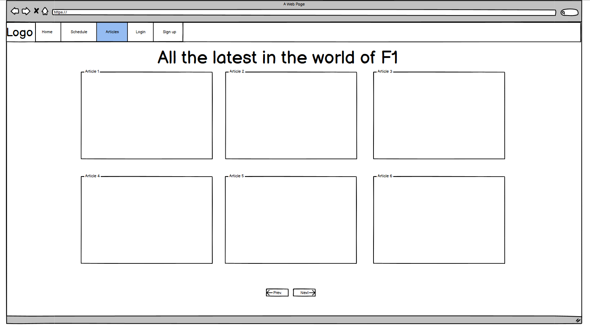

# F1 Town Square

[Link to live site]() 

## Table of Contents

- [UI/UX](#uiux)
    - [Agile](#agile)
    - [Wireframes](#wireframes)
    - [Site Goals](#site-goals)
    - [5 Planes of UX](#5-planes-of-ux)
    - [Visual Design Choices](#visual-design-choices)
    
- [Features](#features)
    - [Current Features](#current-features)
    - [Future Features](#future-features)
   
- [Database Design](#database-design)
    - [Database Model](#database-model)
    - [Custom Model](#custom-model)
    - [CRUD](#crud)

- [Technologies Used](#technologies-used)
    - [Environemnts](#environments)
    - [Python Libraries and Packages](#python-libraries-and-packages)
    - [Django Packages](#django-packages)
    - [External Libraries and Packages](#external-libraries-and-packages)
    - [Database](#database) 

- [Testing](#testing)
    - [Test Guide](#test-guide)
    - [Validator Testing](#validator-testing)
    - [Browser Testing](#browser-testing)
    - [Addressed Bugs](#addressed-bugs)
    - [Unaddressed Bugs](#unaddressed-bugs)

- [Deployment](#deployment)
    - [Local Deployment](#local-deployment)
    - [Live Deployment](#live-deployment)

- [Source Credits](#source-credits)
    - [Technical](#technical)
    - [Media](#media)
    - [Honorable Mentions](#honorable-mentions)
    

## UI/UX

### Agile

### Wireframes

The initial Balsamiq wireframes are very simplified mockups of site layout to help steer development.

    

        Wireframes
    

    
    
    
    

### Site Goals

### 5 Planes of UX

#### Strategy

#### Scope

#### Structure

#### Skeleton

#### Surface

### Visual Design Ideology

**Colour Scheme:**

**Fonts:**

**Images:**

**Icons:**

## Features

### Current Features

### Future Features

## Database Design

### Database Model
The entiry relationship diagram for the initial database model was made using [Cacoo's](https://cacoo.com) diagram tool.

### Custom Model

### CRUD

The principles of CRUD are at the essence of this project's features and any future features.

**Create:**
An authenticated user can create comments and send messages in the live chat.

**Read:**
A user can browse and read articles posted by the site admin, as well as the conversation in the live chat.

**Update:**
An authenticated user can edit and update their individual contributions to the site.

**Delete:**
An authenticated user can delete any of their contributions made to the site.

## Technologies Used

### Environments

- [Balsamiq](https://www.balsamiq.com/) (Wireframes)
- [Lucid](https://lucid.app/) (ERD diagrams)
- [GitHub](https://github.com/) (Version control)
- [GitPod](https://gitpod.io/) (IDE)
- [Heroku](https://heroku.com/) (Site hosting)

### Python Libraries and Packages

### Django Packages

- [django-allauth](https://django-allauth.readthedocs.io/en/latest/) (User authentication)
- [django-crispy-forms](https://django-crispy-forms.readthedocs.io/en/latest/) (Control rendering behaviour of Django forms)
- [Channels](https://pypi.org/project/channels/) (Augments django with async, and event-driven capabilities- used for the live chat on the home page)
- [Daphne](https://pypi.org/project/daphne/) (Django ASGI (HTTP/WebSocket) server)

### External Libraries and Packages

### Database

- [CI Database Maker](https://dbs.ci-dbs.net/) (PostgreSQL database hosting provided by Code Institute)

## Testing

### Test Guide

### Validator Testing

#### HTML [W3C validator](https://validator.w3.org/)

#### CSS [Jigsaw](https://jigsaw.w3.org/css-validator/)

#### JavaScript [JSHint](https://jshint.com/) 

#### Python [CI Python Linter](https://pep8ci.herokuapp.com/)

#### Accessibility [axe DevTools Chrome Extension](https://chrome.google.com/webstore/detail/axe-devtools-web-accessib/lhdoppojpmngadmnindnejefpokejbdd)

#### Performance, Accessibility, SEO, Best Practices (Lighthouse Chrome DevTools)

### Browser Testing

**Layout:**

**Functionality:** 

### Addressed Bugs

### Unaddressed Bugs

## Deployment

### Local Deployment

### Live Deployment

## Source Credits

### Technical

### Media
- By GabrielStella - Own work, CC BY-SA 3.0, https://commons.wikimedia.org/w/index.php?curid=101760446

### Honorable Mentions
