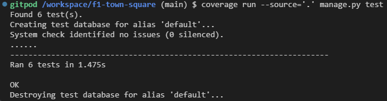
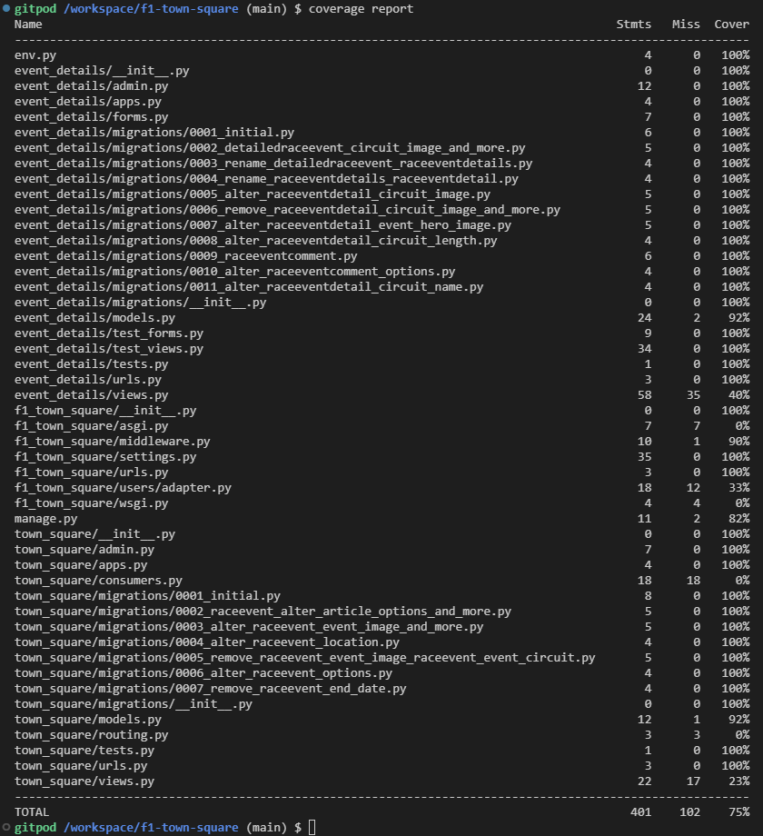

# Automatic and manual testing

Back to [README.md](README.md)

## Automatic testing
Please refer to [test_forms](event_details/test_forms.py) and [test_views](event_details/test_views.py) for the automatic test's code.

All automatic tests passed.
    

    

        Test coverage report.
    

    

    

    

## Manual testing
Below is a breakdown of the various manual tests that have been carried out to ensure a uniform functionality and response across the site.

| **Feature**                | **Action**                                                                                  | **Expected Output**                                                                                                                                                                      | **Actual Output**                                                                                                                    |
|----------------------------|---------------------------------------------------------------------------------------------|------------------------------------------------------------------------------------------------------------------------------------------------------------------------------------------|--------------------------------------------------------------------------------------------------------------------------------------|
| **Header**                 |                                                                                             |                                                                                                                                                                                          |                                                                                                                                      |
| Navigation Bar             | Click on Home link                                                                          | User is redirected to the Home page                                                                                                                                                      | User is redirected to the Home page                                                                                                  |
| Navigation Bar             | Click on site logo                                                                          | User is redirected to the Home page                                                                                                                                                      | User is redirected to the Home page                                                                                                  |
| Navigation Bar             | Click on Calendar link                                                                      | User is redirected to the Calendar page                                                                                                                                                  | User is redirected to the Calendar page                                                                                              |
| Navigation Bar             | Click on Sign in link while signed out                                                      | User is redirected to the sign in page with login form                                                                                                                                   | User is redirected to the sign in page with login form                                                                               |
| Navigation Bar             | Click on Register link while signed out                                                     | User is redirected to the sign up page with registration form                                                                                                                            | User is redirected to the sign up page with registration form                                                                        |
| Navigation Bar             | Gauge which navbar link is currently being visited                                          | The current page is highlighted with the consistent borders across the page                                                                                                              | The current page is highlighted with the consistent borders across the page                                                          |
| Navigation Bar             | Toggle open navbar on smaller display by tapping the burger menu icon                       | Navbar extends with all navigation links prominently displayed                                                                                                                           | Navbar extends with all navigation links prominently displayed                                                                       |
| Navigation Bar             | Toggle close navbar on smaller display by tapping the burger menu icon                      | Navbar collapses to the original state                                                                                                                                                   | Navbar collapses to the original state                                                                                               |
| Navigation Bar             | Hover navbar link                                                                           | Link grows slightly and is highlighted with a thicker border than the current page highlight                                                                                             | Link grows slightly and is highlighted with a thicker border than the current page highlight                                         |
| User status                | Check for users own authentication status                                                   | If signed out displays "You are not logged in!" if signed in displays "You are logged in <username>!"                                                                                    | If signed out displays "You are not logged in!" if signed in displays "You are logged in <username>!"                                |
| **Home Page**              |                                                                                             |                                                                                                                                                                                          |                                                                                                                                      |
| Featured races             | Check display of upcoming and recent races                                                  | The closest upcoming race and the previous 3 are visible                                                                                                                                 | The closest upcoming race and the previous 3 are visible                                                                             |
| Featured races             | Click on a race card                                                                        | User is redirected to the respective Event Details page                                                                                                                                  | User is redirected to the respective Event Details page                                                                              |
| Town Chat                  | Read messages sent                                                                          | Opening the home page posts a welcome message in the chat and any message sent by any user after connecting is visible until refresh                                                     | Opening the home page posts a welcome message in the chat and any message sent by any user after connecting is visible until refresh |
| Town Chat                  | Enter a message and click Send                                                              | The message appears in the chat instantly and is visible to all connected users                                                                                                          | The message appears in the chat instantly and is visible to all connected users                                                      |
| Town Chat                  | Try to send an empty message                                                                | Nothing will happen as an empty message string can't be sent                                                                                                                             | Nothing happens, the chat does not get spammed with empty strings                                                                    |
| Town Chat                  | Refresh the page                                                                            | All messages are lost on refresh to simulate a real world conversation                                                                                                                   | The chat is empty again and only new messages are displayed                                                                          |
| Town Chat                  | Try to create a message while signed out                                                    | Prompt to sign in is shown in place of the input field                                                                                                                                   | Prompt to sign in is shown in place of the input field                                                                               |
| Town Chat                  | Send a string longer than the chat width                                                    | Message breaks into multiple lines as opposed to overflowing                                                                                                                             | Message breaks into multiple lines as opposed to overflowing                                                                         |
| Town Chat                  | Fill container height with messages                                                         | Y-scrollbar appears to allow scrolling through overflow                                                                                                                                  | Y-scrollbar appears to allow scrolling through overflow                                                                              |
| **Calendar Page**          |                                                                                             |                                                                                                                                                                                          |                                                                                                                                      |
| Calendar Display           | Check the display of race dates and names                                                   | All races of the current season are listed with correct dates, names, flags, and circuit imagery                                                                                         | All races of the current season are listed with correct dates, names, flags, and circuit imagery                                     |
| Race Cards                 | Click on a race card                                                                        | User is redirected to the respective Event Details page                                                                                                                                  | User is redirected to the respective Event Details page                                                                              |
| Race Cards                 | Hover any race card                                                                         | Hovered card grows slightly and the borders turn red until no longer hovered                                                                                                             | Hovered card grows slightly and the borders turn red until no longer hovered                                                         |
| **Event Details Page**     |                                                                                             |                                                                                                                                                                                          |                                                                                                                                      |
| Race Information           | Check race details (e.g., circuit, event info, circuit stats, etc.)                         | All information is accurate and displayed correctly                                                                                                                                      | All information is accurate and displayed correctly                                                                                  |
| Comment Section            | Read comments                                                                               | All comments visible to any user. If no comment is posted No one has shared their thoughts yet, be the first!                                                                            | All comments visible to any user. If no comment is posted No one has shared their thoughts yet, be the first!                        |
| Comment Section            | Submit a comment while logged in                                                            | Button is disabled, comment posted, page refreshed and user is scrolled back down to the comment section where comment is visible                                                        | Page refreshed and user is scrolled back down to the comment section where comment is visible                                        |
| Comment Section            | Submit a comment while logged out                                                           | Redirected to sign in page                                                                                                                                                               | Redirected to sign in page                                                                                                           |
| Comment Section            | Refresh the page after a comment is submitted                                               | Comment persists and is still visible                                                                                                                                                    | Comment persists and is still visible                                                                                                |
| Comment Section            | Edit a comment while logged in as the author                                                | Edit button becomes Cancel button, comment field changes to text input with a save button below, clicking save disables button, updates the comment, refreshes page, and restores scroll | Comment text is updated, page refreshed and scroll restored                                                                          |
| Comment Section            | Cancel editing with cancel button                                                           | The comment is restored to its original read-only view and the Cancel button is once again an Edit button                                                                                | The comment is restored to its original read-only view and the Cancel button is once again an Edit button                            |
| Comment Section            | Edit a comment while logged in as a different user                                          | Edit button is not available, redirected to 404 with error message if done with URL                                                                                                      | Edit button is not available, redirected to 404 with error message if done with URL                                                  |
| Comment Section            | Edit a comment through URL while signed out                                                 | User is redirected to the sign in page                                                                                                                                                   | User is redirected to the sign in page                                                                                               |
| Comment Section            | Delete a comment while logged in as the author                                              | Delete button opens confirmation modal, clicking delete again disables button, deletes comment, refreshes page, and restores scroll                                                      | The comment is removed from the comment section, page refreshed and scroll restored                                                  |
| Comment Section            | Delete a comment while logged in as a different user                                        | Delete button is not available, redirected to 404 with error message if done with URL                                                                                                    | Delete button is not available, redirected to 404 with error message if done with URL                                                |
| Comment Section            | Delete a comment through URL while signed out                                               | User is redirected to the sign in page                                                                                                                                                   | User is redirected to the sign in page                                                                                               |
| Comment Section            | Approve comment button                                                                      | If any comment is unapproved and user is superuser, the comment along with an approve button is visible                                                                                  | Any unapproved comment is visible along with an approve button                                                                       |
| Comment Section            | Approve comment                                                                             | Approve button is disabled when clicked and page is refreshed with the user scrolled back to the comment and comment is now approved                                                     | Approve button is disabled when clicked and page is refreshed with the user scrolled back to the comment and comment is now approved |
| Comment Section            | Approve comment through URL as non superuser                                                | User is redirected to /not_an_admin 404 page with an error message                                                                                                                       | User is redirected to /not_an_admin 404 page with an error message                                                                   |
| Comment Section            | Fill more than the height of the comment container                                          | A seamless scrollbar matching the border appears allowing overflow to be scrolled                                                                                                        | A seamless scrollbar matching the border appears allowing overflow to be scrolled                                                    |
| Comment Section            | Post a comment longer than container width                                                  | Comment is broken into multiple lines, no overflow                                                                                                                                       | Comment is broken into multiple lines, no overflow                                                                                   |
| **Authentication**         |                                                                                             |                                                                                                                                                                                          |                                                                                                                                      |
| Registration               | Fill out registration form and submit                                                       | User account is created, signed in, and redirected to the previous page                                                                                                                  | User account is created, signed in, and redirected to the previous page                                                              |
| Registration               | Submit before filling out required fields                                                   | Error message is showed for any required field that is not filled out                                                                                                                    | Error message is showed for any required field that is not filled out                                                                |
| Login                      | Fill out sign in form with correct credentials and submit                                   | User is logged in and redirected to the previous page                                                                                                                                    | User is signed in and redirected to the previous page                                                                                |
| Login                      | Fill out sign in form with incorrect credentials and submit                                 | Error message is displayed indicating incorrect credentials                                                                                                                              | Error message is displayed indicating incorrect credentials                                                                          |
| Logout                     | Click Sign out button                                                                       | User is signed out and redirected to the previous page                                                                                                                                   | User is signed out and redirected to the previous page                                                                               |
| Logout                     | Click Cancel button                                                                         | Sign out is cancelled and user is taken back to previous page                                                                                                                            | Sign out is cancelled and user is taken back to previous page                                                                        |
| **Miscellaneous**          |                                                                                             |                                                                                                                                                                                          |                                                                                                                                      |
| Responsive Design          | Resize the browser window or view on different devices                                      | The layout adjusts correctly for different screen sizes (mobile, tablet, desktop)                                                                                                        | The layout adjusts correctly for different screen sizes (mobile, tablet, desktop)                                                    |
| Error Handling             | Navigate to a non-existent page                                                             | Custom 404 error page is displayed                                                                                                                                                       | Custom 404 error page is displayed                                                                                                   |
| Static Files               | Check the loading of images, CSS, and JS files                                              | All static files load correctly and without errors                                                                                                                                       | All static files load correctly and without errors                                                                                   |
| Previous URL redirection   | Start an account authentication action (Sign in, sign up, sign out) from any site page      | User is redirected to the page they were on before going to the /accounts/ URL after finishing auth. action                                                                              | User is redirected to the page they were on before going to the /accounts/ URL after finishing auth. action                          |
| Previous URL redirection   | Start an account authentication action (Sign in, sign up, sign out) from an /accounts/ page | User is redirected to the page they were on before going to any /accounts/ URL after finishing auth. action. The /accounts/ URLs will not be stored                                      | User is redirected to the page they were on before going to any /accounts/ URL after finishing auth. action.                         |
| Previous URL redirection   | Start an account authentication action (Sign in, sign up, sign out) from a 404 page         | User is redirected to the home page as there is not reason to go back to a 404 page                                                                                                      | User is redirected to the home page                                                                                                  |
| Successful action messages | Perform sign up, sign in, sign out, comment submission, approval, edit, and deletion        | Each successful action, when redirected, produces a self closing success message which can be closed manually too                                                                        | Each successful action, when redirected, produces a self closing success message which can be closed manually too                    |
| External links             | Open external link from page footer                                                         | Link opens in a new page                                                                                                                                                                 | Link opens in a new page                                                                                                             |

Back to [README.md](README.md)